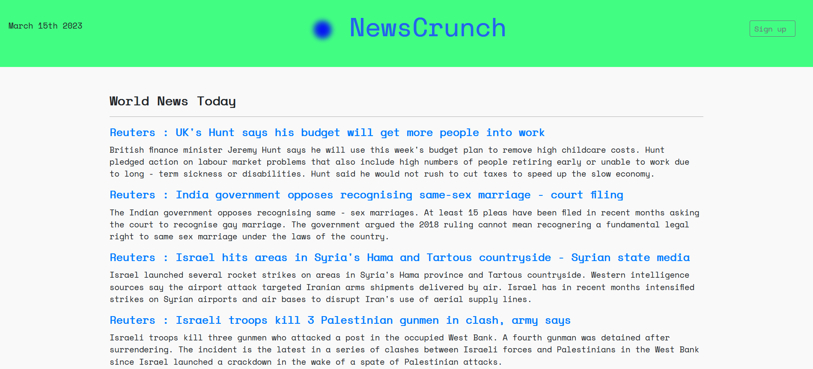

<div align="center">
<h1  style="display: block; font-size: 2.5em; font-weight: bold;"> <br /><br /><strong>NewsCrunch</strong> </h1>

<h1></h1>
</div>


NewsCrunch is an application to scrape articles from news sites and use a combination of NLP methods to present condensed versions of the daily top stories.

- Articles scraped from reputable sites
- Similarity check to avoid article repetition 
- Combination of abstractive and extractive summary methods
- Cronscheduler to scrape news daily

Inspired by a need to keep up with world news. While summarising news does come with caveats, I found that a combination of extractive and abstractive summaries resulted in the most accurate represenation of articles. 

## Installation 

Clone this repo, and install all required packages using
````
pip install -r requirements.txt
````
run the following commands to setup the sqlite database
````
python manage.py makemigrations
python manage.py migrate
````
Run the following command to run the Django server
````
python manage.py runserver
````
In a seperate terminal, run the Django custom command using
````
python manage.py aggregate 
````
This will run a cronsheduler to srape and summarize articles daily

## Technologies

The main stack used in `Django`, `Pytorch` , `BS4`,  `NLTK` and the `Transformers` module.

Extractive summary using TF-IDF Tern Frequency Inverse Document Frequency
Abstractive summary using small2bert model 

## How it Works

1. Call `NewsApi` to get headlines and links.
2. Check similarity between headlines.
3. Scrape article using `Requests` and `BeautifulSoup4`.
4. Create word corpus using `Spacy` .
5. Perform extractive summary to reduce article to the top 5 sentences.
6. Perform abstractive summary using `Small2Bert` model. 
7. Add to database after performing grammar check. 

<!-- ## Roadmap -->

